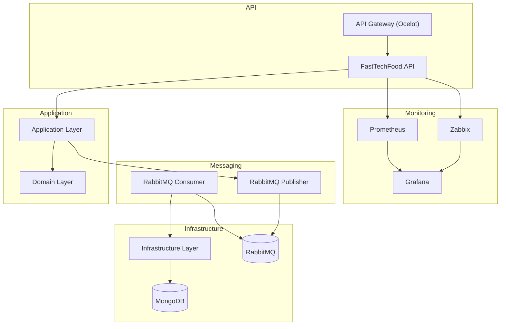

# 🍔 FastTechFood
O **FastTechFood** é um MVP desenvolvido com arquitetura de microsserviços utilizando .NET 8, RabbitMQ, MongoDB e uma stack moderna de observabilidade com Prometheus, Grafana e Zabbix.

---
## 📌 Objetivo
Automatizar o processo de pedidos de alimentos com suporte a alta disponibilidade, escalabilidade e observabilidade, utilizando tecnologias modernas como .NET 8, Kubernetes, RabbitMQ e MongoDB.

---
## 🚀 Tecnologias Utilizadas
- .NET 8 (C#)
- MongoDB
- RabbitMQ
- Docker & Docker Compose
- Kubernetes (k8s)
- API Gateway (Ocelot)
- Prometheus + Grafana
- Zabbix Server e Agent 2
---
## 📦 Estrutura de Pastas
```bash
FastTechFood/
├── FastTechFood.API              # Web API principal
├── FastTechFood.API.Gateway     # API Gateway (Ocelot)
├── FastTechFood.Application     # Camada de aplicação (DTOs, services)
├── FastTechFood.Domain          # Camada de domínio (entidades, interfaces)
├── FastTechFood.Infrastructure  # Infraestrutura e persistência (MongoDB)
├── FastTechFood.Messaging       # RabbitMQ: producers e consumers
├── FastTechFood.Tests           # Testes unitários e de integração
├── grafana                      # Configurações e dashboards do Grafana
├── k8s                          # Manifests Kubernetes (deployments, PVC, services)
├── scripts                      # Scripts auxiliares
├── docker-compose.yml           # Subida local completa com Docker
├── prometheus.yml               # Configuração do Prometheus
├── README.md                    # Este arquivo 🙂
```
---
## ☸️ Estrutura Kubernetes (`k8s/`)
- k8s/
  - configmaps/
    - api-configmap.yaml
    - gateway-configmap.yaml
    - mongodb-configmap.yaml
    - prometheus-configmap.yaml
  - deployments/
    - api-deployment.yaml
    - gateway-deployment.yaml
    - mongodb-deployment.yaml
    - zabbix-server-deployment.yaml
  - services/
    - api-service.yaml
    - gateway-service.yaml
    - mongodb-service.yaml
    - prometheus-service.yaml
    - zabbix-service.yaml
  - persistentvolumeclaims/
    - mongodb-pvc.yaml
    - prometheus-pvc.yaml
  - namespace.yaml
---
## ☸️ Deploy no Kubernetes (Minikube, Docker Desktop, etc.)
```bash
# 1. Primeiro crie o namespace
kubectl apply -f k8s/namespace.yaml

# 2. Aplique os PersistentVolumeClaims (armazenamento para bancos de dados)
kubectl apply -f k8s/persistentvolumeclaims/

# 3. Aplique os ConfigMaps (configurações dos serviços)
kubectl apply -f k8s/configmaps/

# 4. Aplique os Deployments (aplicações em si, inclusive o zabbix-agent2)
kubectl apply -f k8s/deployments/

# 5. Por último, aplique os Services (acesso aos serviços)
kubectl apply -f k8s/services/

# Verifique todos os recursos no namespace
kubectl get all,pvc -n fasttechfood
```
---
## ▶️ Como Executar o Projeto (Local)
```bash
1. Clone o repositório:
git clone https://github.com/seu-usuario/fasttechfood.git
cd fasttechfood

2. Suba os serviços com Docker Compose:
docker-compose up --build
````
---
## 🔗 Endpoints dos Serviços
- **API:** [http://localhost:5000](http://localhost:5000)
- **Gateway:** [http://localhost:8000](http://localhost:8000)
- **MongoDB:** `mongodb://localhost:27017`
- **RabbitMQ UI:** [http://localhost:15672](http://localhost:15672)
- **Zabbix UI:** [http://localhost:8080](http://localhost:8080)
- **Grafana:** [http://localhost:3000](http://localhost:3000)
---
## 📮 Comunicação entre Microsserviços
O projeto utiliza **RabbitMQ** para troca de mensagens assíncronas entre os microsserviços. Um exemplo de fluxo:
1. `FastTechFood.API` publica um pedido no **RabbitMQ**.
2. `PedidoConsumerHandler` consome e processa o pedido.
3. O pedido é persistido no **MongoDB**.
4. Métricas são expostas via `/metrics` e monitoradas pelo **Prometheus**.
---
## 📊 Observabilidade
- 📈 **Prometheus** coleta métricas da API e do MongoDB
- 📉 **Grafana** exibe dashboards customizados
- 🔍 **Zabbix** monitora recursos e eventos com agente ativo
---
## 🧪 Testes
Execute os testes com:
```bash
dotnet test
````
---
## 📐 Arquitetura da Solução

---
