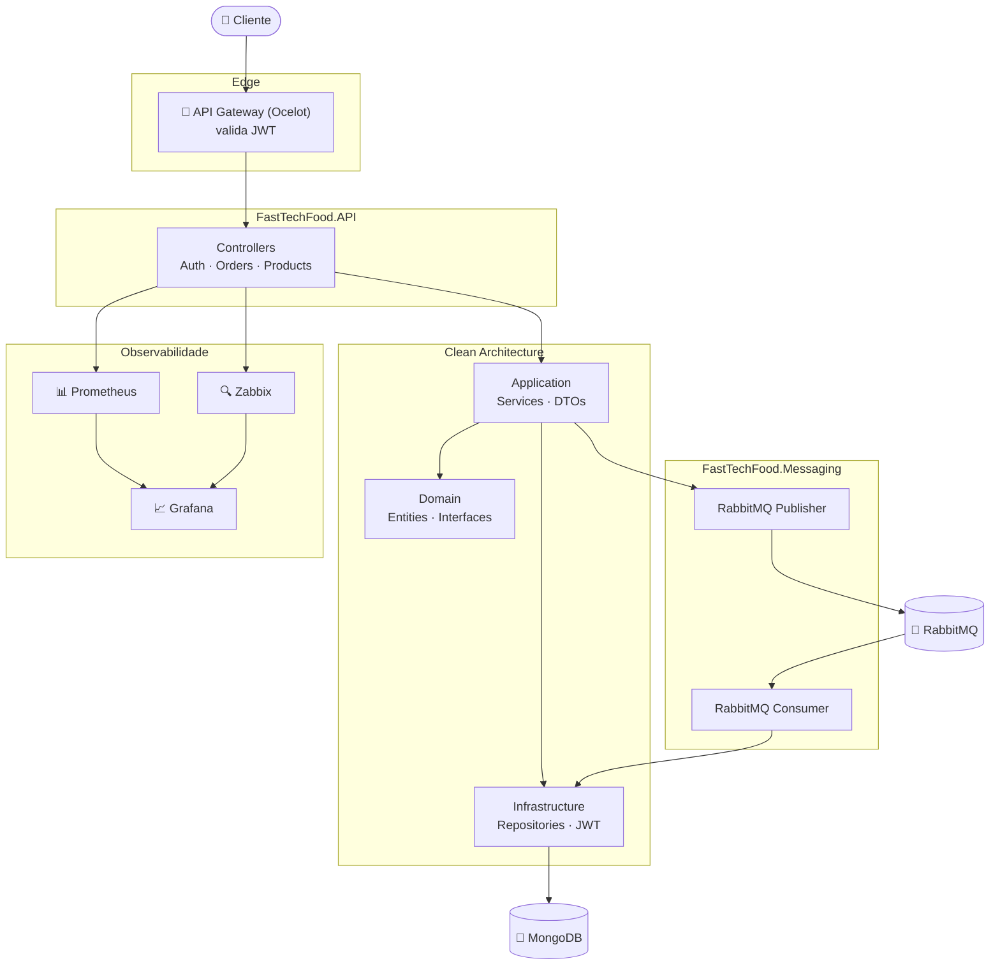

<div align="center">

# 🍔 FastTechFood

**MVP de plataforma de pedidos de alimentos com arquitetura de microsserviços em .NET 8, mensageria com RabbitMQ, persistência em MongoDB e uma stack completa de observabilidade (Prometheus, Grafana e Zabbix).**

[](https://dotnet.microsoft.com/)
[](https://learn.microsoft.com/dotnet/csharp/)
[](https://www.mongodb.com/)
[](https://www.rabbitmq.com/)
[](https://github.com/ThreeMammals/Ocelot)
[](https://jwt.io/)
[](https://www.docker.com/)
[](https://kubernetes.io/)
[](https://prometheus.io/)
[](https://grafana.com/)
[](https://www.zabbix.com/)
[](https://xunit.net/)
[](https://github.com/features/actions)
[](#)

</div>

---

## 📌 Objetivo

Automatizar o processo de pedidos de alimentos com suporte a alta disponibilidade, escalabilidade e observabilidade, utilizando tecnologias modernas como .NET 8, Kubernetes, RabbitMQ e MongoDB. A solução segue **Clean Architecture** (Domain, Application, Infrastructure) com autenticação **JWT** e comunicação assíncrona entre serviços.

## 🚀 Tecnologias utilizadas

| Categoria | Tecnologia |
|-----------|-----------|
| Linguagem / Runtime | .NET 8 (C# 12) |
| API | ASP.NET Core Web API + Swagger |
| Autenticação | JWT (Bearer) |
| API Gateway | Ocelot |
| Banco de dados | MongoDB |
| Mensageria | RabbitMQ (publishers / consumers) |
| Observabilidade | Prometheus + Grafana + Zabbix (Agent 2) |
| Containerização | Docker & Docker Compose |
| Orquestração | Kubernetes (k8s) |
| Testes | xUnit |
| CI/CD | GitHub Actions |

## 📦 Estrutura de pastas

```bash
FastTechFood/
├── FastTechFood.API              # Web API principal (Auth, Orders, Products)
├── FastTechFood.API.Gateway      # API Gateway (Ocelot) + validação JWT
├── FastTechFood.Application       # Camada de aplicação (DTOs, services, interfaces)
├── FastTechFood.Domain            # Domínio (entidades, enums, exceptions, interfaces)
├── FastTechFood.Infrastructure    # Persistência MongoDB, JWT, migrations
├── FastTechFood.Messaging         # RabbitMQ: publishers e consumers
├── FastTechFood.Tests             # Testes (controllers e services)
├── grafana/                       # Dashboards e provisioning do Grafana
├── k8s/                           # Manifests Kubernetes
├── scripts/                       # Scripts de métricas
├── docker-compose.yml             # Subida local completa
├── prometheus.yml                 # Configuração do Prometheus
└── README.md
```

## ☸️ Estrutura Kubernetes (`k8s/`)

```
k8s/
├── namespace.yaml
├── configmaps/
│   ├── grafana-config.yaml
│   ├── prometheus-config.yaml
│   ├── zabbix-agent-config.yaml
│   └── zabbix-server-config.yaml
├── deployments/
│   ├── 1 - rabbitmq.yaml
│   ├── 2-mongodb.yaml
│   ├── 3-fasttechfood-api.yaml
│   ├── 4-fasttechfood-api-gateway.yaml
│   ├── 5-prometheus.yaml
│   ├── 6-grafana.yaml
│   ├── 7-zabbix-db.yaml
│   ├── 8-zabbix-server.yaml
│   ├── 9-zabbix-web.yaml
│   ├── 10-zabbix-agent.yaml
│   └── 11-zabbix-template-importer.yaml
├── services/            # (api, gateway, mongodb, rabbitmq, prometheus, grafana, zabbix-*)
└── persistentvolumeclaims/
    ├── mongodb-pvc.yaml
    └── zabbix-db-pvc.yaml
```

## 📐 Arquitetura da solução


```mermaid
graph TD
    Client([👤 Cliente]) --> APIGateway

    subgraph Edge
        APIGateway["🚪 API Gateway (Ocelot)<br/>valida JWT"]
    end

    subgraph API["FastTechFood.API"]
        FastTechFoodAPI["Controllers<br/>Auth · Orders · Products"]
    end

    subgraph Camadas["Clean Architecture"]
        AppLayer["Application<br/>Services · DTOs"]
        DomainLayer["Domain<br/>Entities · Interfaces"]
        InfraLayer["Infrastructure<br/>Repositories · JWT"]
    end

    subgraph Messaging["FastTechFood.Messaging"]
        MessagingPublisher["RabbitMQ Publisher"]
        MessagingConsumer["RabbitMQ Consumer"]
    end

    MongoDB[(🍃 MongoDB)]
    RabbitMQ[(🐇 RabbitMQ)]

    subgraph Monitoring["Observabilidade"]
        Prometheus["📊 Prometheus"]
        Zabbix["🔍 Zabbix"]
        Grafana["📈 Grafana"]
    end

    APIGateway --> FastTechFoodAPI
    FastTechFoodAPI --> AppLayer
    AppLayer --> DomainLayer
    AppLayer --> InfraLayer
    AppLayer --> MessagingPublisher
    MessagingPublisher --> RabbitMQ
    RabbitMQ --> MessagingConsumer
    MessagingConsumer --> InfraLayer
    InfraLayer --> MongoDB

    FastTechFoodAPI --> Prometheus
    FastTechFoodAPI --> Zabbix
    Prometheus --> Grafana
    Zabbix --> Grafana
```

## 📮 Comunicação entre microsserviços

O projeto usa **RabbitMQ** para troca de mensagens assíncronas. Fluxo típico de um pedido:

1. `FastTechFood.API` publica o pedido no **RabbitMQ** (`RabbitMQPublisherService`).
2. `PedidoConsumerHandler` consome e processa a mensagem.
3. O pedido é persistido no **MongoDB**.
4. Métricas são expostas em `/metrics` e coletadas pelo **Prometheus**.

## ▶️ Como executar (local — Docker Compose)

```bash
git clone https://github.com/cabxavier/FastTechFood.git
cd FastTechFood

docker-compose up --build
```

### Endpoints (Docker Desktop)

| Serviço | URL |
|---------|-----|
| API | http://localhost:5000 |
| Gateway | http://localhost:5001 |
| MongoDB | `mongodb://localhost:27017` |
| RabbitMQ UI | http://localhost:15672 |
| Zabbix UI | http://localhost:8080 |
| Prometheus | http://localhost:9090 |
| Grafana | http://localhost:3000 |

## ☸️ Deploy no Kubernetes (Minikube / Docker Desktop)

```bash
kubectl apply -f k8s/namespace.yaml
kubectl apply -f k8s/persistentvolumeclaims/
kubectl apply -f k8s/configmaps/
kubectl apply -f k8s/deployments/
kubectl apply -f k8s/services/

kubectl get all,pvc -n fasttechfood
```

### Endpoints (Kubernetes / NodePort)

| Serviço | URL |
|---------|-----|
| API | http://localhost:30416 |
| Gateway | http://localhost:30165 |
| MongoDB | `mongodb://localhost:30722` |
| RabbitMQ UI | http://localhost:31672 |
| Zabbix UI | http://localhost:30080 |
| Prometheus | http://localhost:30090 |
| Grafana | http://localhost:30300 |

## 📊 Observabilidade

- **Prometheus** coleta métricas da API e do MongoDB.
- **Grafana** exibe dashboards customizados (provisionados em `grafana/`).
- **Zabbix** monitora recursos e eventos com o Agent 2 ativo.

## 🧪 Testes

```bash
dotnet test
```

## 🔐 Segurança

- O `JwtSettings.Secret` nos `appsettings.json` é um **placeholder** — a chave real deve ser injetada por variável de ambiente / secret em produção.
- Segredos do pipeline (Docker Hub) usam **GitHub Secrets**, nunca versionados.
- As credenciais do stack de monitoramento (RabbitMQ `guest`, Grafana `admin`, Zabbix e MySQL do Zabbix) são **padrões de desenvolvimento local** e devem ser substituídas por **Kubernetes Secrets** em ambientes reais.

---

<div align="center">
Feito com 💜 · .NET 8 · Microsserviços · Observabilidade
</div>
